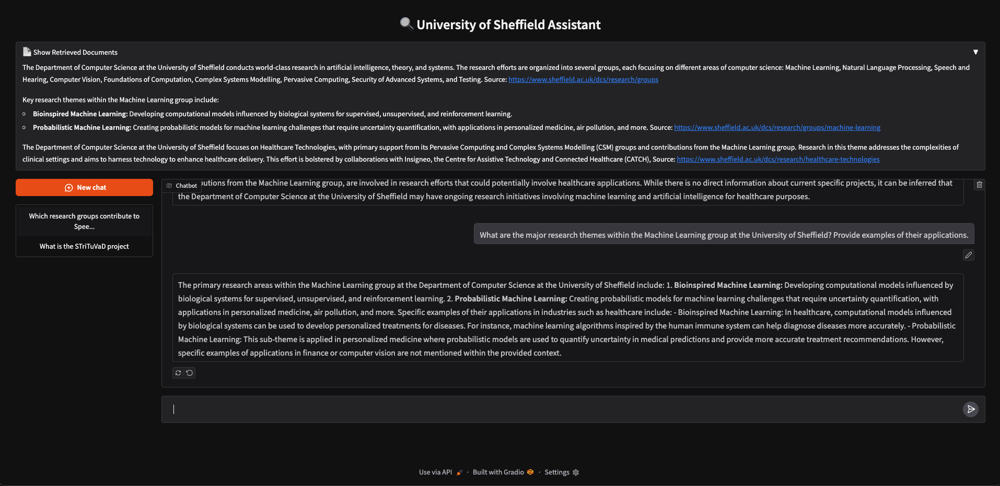
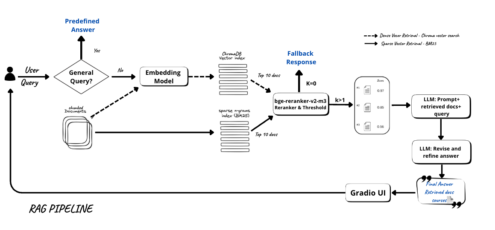

# 🔍 RAG-Based Chatbot for the University of Sheffield




## 📌 Overview

This project implements a **Retrieval-Augmented Generation (RAG)** chatbot designed to answer **research and computer science-related queries** about **the University of Sheffield**. The system integrates **hybrid document retrieval, reranking, and LLM-based answer generation and refinement** to deliver accurate, relevant, and well-formulated responses.

The chatbot is built using:
- **Hybrid retrieval** (BM25 + Chroma vector database)  
- **A reranker model** (FlagEmbedding-based) to improve retrieval results  
- **Llama 3.2 (3B parameter model, FP16)** for response generation and refinement  
- **Gradio** for an interactive UI   

---

## ⚙️ How It Works
### Architecture Overview


### 1️⃣ User Query Processing
- Handles **general questions** (e.g., greetings) with predefined responses.  
- For **research-specific queries**, retrieves context from a custom knowledge base.

### 2️⃣ Document Retrieval and Reranking
- Retrieval pipeline includes:
  - ✅ **BM25** (keyword-based)
  - ✅ **Chroma** (vector similarity)
  - ✅ **Ensemble Retrieval** (equal weighting of BM25 + Chroma)
  - ✅ **FlagReranker** (filters irrelevant docs, discards those with score < 0.2)

### 3️⃣ Answer Generation (LLM-Powered)
- Uses **Llama 3.2 (3B Instruct FP16)** with a strict instruction to **only answer using provided context**.  
- Fallback response shown if no relevant documents are retrieved.

### 4️⃣ Answer Refinement
- Performs a second LLM pass to:
  - Improve clarity, completeness, and factual grounding
  - Avoid unsupported content

### 5️⃣ Gradio UI for User Interaction
- 💬 **Real-time Chat Interface**
- 📂 **Expandable Retrieved Documents**
- ⏱ **Streaming Word-by-Word Responses**

---

## 🛠 Installation and Setup

### ✅ Install Dependencies
```bash
pip install -r requirements.txt
```

### 🔐 Set API Key for Trivy Web Search (used in Evaluation)
```python
_set_env("TAVILY_API_KEY")
```

### 📥 Download and Serve Llama 3.2 (3B Instruct FP16)
```bash
curl -fsSL https://ollama.com/install.sh | sh
nohup ollama serve > /dev/null 2>&1 &
ollama pull llama3.2:3b-instruct-fp16 > /dev/null 2>&1 &
```

### 📂 Extract and Process Research Documents
```python
with zipfile.ZipFile("path_to_data_zip_file", "r") as zip_ref:
    zip_ref.extractall("parsed_data")
```

### 🚀 Run the Chatbot
```python
demo.launch(share=True, debug=True)
```

---

## 📊 Evaluation of the RAG Chatbot vs. Baseline Models

This framework conducts an in-depth evaluation of the RAG chatbot compared to traditional and baseline systems using **105 test queries**.

### ✅ Evaluation Components:

#### 1. Retrieval Evaluation
- Compared: **RAG**, **TF-IDF**, **BM25**
- Metrics:
  - Relevance Score (0–5)
  - Hit Rate (≥4)
  - Retrieval Time
- Logs: `/content/retrieval_scores_result.txt`
- LLM-Based Pairwise Judgments: `/content/retrieval_comparison_results.txt`

#### 2. Answer Generation Evaluation
- Compared: **RAG**, **LLM-Only**, **Web Search Chatbot**, **TF-IDF + LLM**
- Metrics:
  - Answer Score (1–5)
  - Coherence, Fluency, Relevance (1–5)
  - Hallucination (1–3)
  - Answer Time
- Logs:
  - Answer quality: `/content/answer_scores_result.txt`
  - Hallucinations: `/content/hallucination_score.txt`
  - Fluency, Relevance, Coherence: `/content/chatbot_quality_score.txt`

#### 3. RAGAS Evaluation (Automatic LLM Evaluation)
- Metrics:
  - Context Recall
  - Faithfulness
  - Factual Correctness (F1)
  - Context Precision (with & without reference)
- Inputs: Generated from `.json` data files

---

## 📈 Visual Outputs
- 📊 Bar Charts for: Average scores, hit rates, response times
- 📉 Histograms: Hallucination score distributions
- 🧠 Side-by-side Retrieval Judgments (LLM preference counts)

---

## 🏁 Conclusion

This project demonstrates a practical implementation of a robust and explainable RAG chatbot designed to answer domain-specific queries using context-grounded LLM responses.  
With extensive evaluation pipelines and a clean user interface, this system is **well-suited for research discovery, academic chatbots, and institutional support bots**.

---
